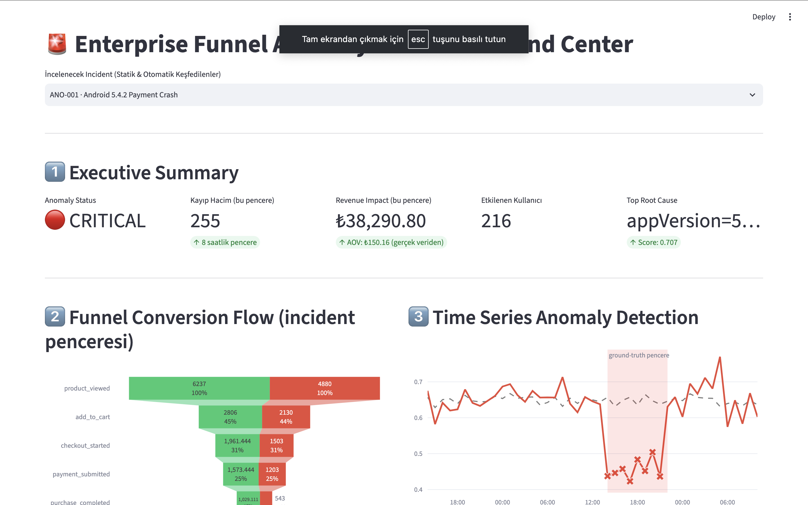
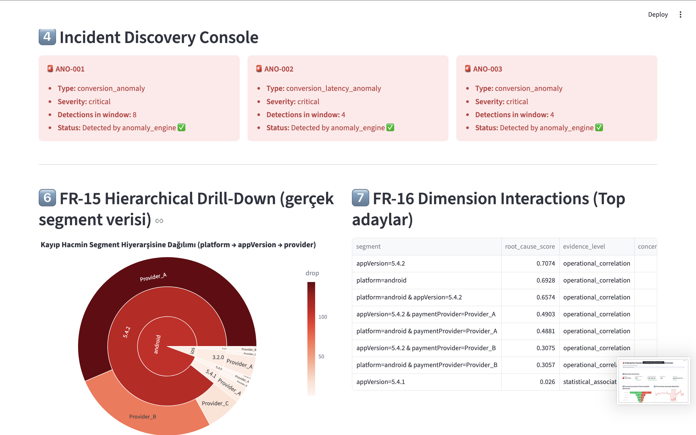
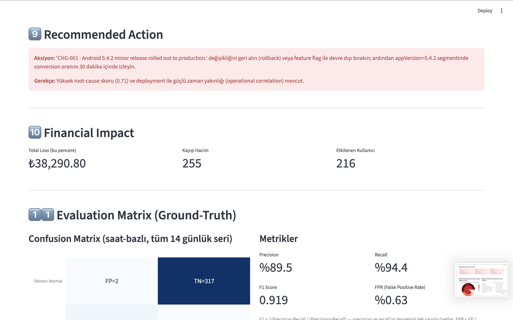
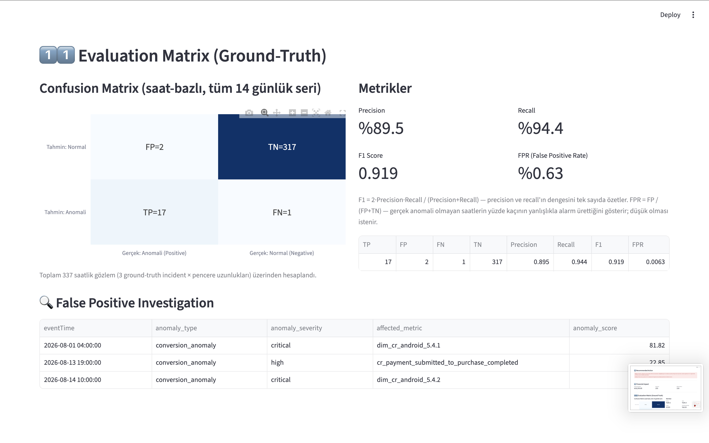

# 🚨 Enterprise Funnel Anomaly Detection & RCA Command Center

An enterprise analytics platform for automatically detecting funnel anomalies, identifying potential root causes, and providing explainable insights into business metric deviations.

The system analyzes funnel performance across dimensions such as platform, app version, provider, and other customer segments. It combines statistical anomaly detection, hierarchical drill-down analysis, interaction analysis, and operational event correlation to investigate incidents.


---

## 📑 Table of Contents

- [Dashboard Preview](#-dashboard-preview)
- [Project Overview](#-project-overview)
- [Key Features](#-key-features)
- [Example Incident](#-example-incident)
- [Root Cause Scoring](#-root-cause-scoring)
- [False Positive Investigation](#-false-positive-investigation)
- [Observability](#-observability)
- [System Architecture](#-system-architecture)
- [Technology Stack](#-technology-stack)
- [Project Structure](#-project-structure)
- [Installation](#-installation)
- [Run the Dashboard](#-run-the-dashboard)
- [Testing](#-testing)
- [What I Learned](#-what-i-learned)
- [Future Improvements](#-future-improvements)
- [Author](#-author)

---

## 🖼️ Dashboard Preview

**Executive Summary — anomaly status, financial impact, and funnel conversion flow compared against a healthy baseline, with the time-series anomaly detection window highlighted:**



**Incident Discovery Console — automatically detected anomalies, hierarchical drill-down by platform → app version → provider, and ranked root cause candidates with evidence levels:**



**Recommended Action & Financial Impact — an explainable, actionable recommendation tied to the top root cause, alongside the quantified revenue and user impact:**



**Evaluation Matrix — confusion matrix and precision/recall/F1/FPR metrics validated against ground-truth incidents, plus false positive investigation:**



---

## 🧭 Project Overview

Unexpected changes in conversion rates can result in significant revenue loss. Detecting an anomaly is only the first step; an analytics system should also help answer:

- When did the anomaly occur?
- How severe is the impact?
- Which customer segment is affected?
- What dimensions explain the deviation?
- Is there an operational event correlated with the anomaly?
- Is the identified factor a possible cause or only an association?

This project provides an automated anomaly detection and Root Cause Analysis (RCA) pipeline to answer these questions.

---

## ✨ Key Features

### Automated Anomaly Detection

The system continuously analyzes funnel metrics and identifies statistically significant deviations from expected behavior.

- Baseline vs. actual metric comparison
- Time-series anomaly detection
- Anomaly severity classification
- Automatic incident discovery
- Detection of sustained metric degradation

### Hierarchical Drill-Down

Detected anomalies are investigated across multiple dimensions:

```text
Platform
   │
   └── Android
        │
        └── Version 5.4.2
             │
             └── Provider A
                  │
                  └── Root Cause Candidate
```

This allows the system to move from a broad anomaly to the most affected segment.

### Root Cause Analysis

Potential root causes are ranked using multiple signals:

- Impact / contribution
- Event relevance
- Interaction gain
- Temporal proximity

The project uses a composite Root Cause Score to prioritize the strongest candidates.

### Dimension Interactions

Some anomalies cannot be explained by a single dimension.

The system therefore analyzes combinations such as:

```text
Platform + App Version
Platform + Provider
App Version + Provider
```

Interaction depth is controlled to prevent excessive combinations and maintain interpretable results.

### Operational Event Correlation

Deployment and operational events can be correlated with detected anomalies.

Example:

```text
13:42  Android v5.4.2 Deployment
13:50  Provider Gateway Update
14:00  Anomaly Detected
```

Temporal proximity is incorporated into the RCA scoring process.

### Explainable RCA

The system distinguishes different levels of evidence instead of automatically claiming causation.

Explanations are labelled as:

- **Observed Fact**
- **Statistical Association**
- **Operational Correlation**
- **Causal Evidence**
- **Hypothesis**

This helps prevent misleading statements such as:

> "The deployment caused the anomaly."

when only temporal correlation has been established.

---

## 📊 Example Incident

A simulated funnel may show:

| Funnel Stage | Baseline | Actual |
| ------------ | -------- | ------ |
| Visit        | 10,000   | 9,800  |
| Product View | 7,500    | 7,400  |
| Add to Cart  | 4,200    | 4,100  |
| Checkout     | 3,100    | 2,900  |
| Purchase     | 2,400    | 720    |

The system detects a significant degradation concentrated at the **Purchase** stage and automatically investigates the affected dimensions.

Example RCA result:

```text
Root Cause Candidate:
Android 5.4.2

Isolation Score:
0.889
```

---

## 🧮 Root Cause Scoring

Potential root causes are evaluated using a weighted score:

```text
RootCauseScore =
    0.35 × Contribution
  + 0.25 × EventRelevance
  + 0.20 × InteractionGain
  + 0.20 × TimeProximity
```

The score combines statistical and operational evidence to rank potential explanations.

---

## 🔍 False Positive Investigation

The system also evaluates whether detected anomalies could represent false positives.

This is important because an anomaly detection system should not treat every statistical deviation as a real business incident.

The project includes monitoring metrics such as:

- Precision
- Recall
- False Positive Rate
- Detection latency
- RCA execution time

Example evaluation (validated against ground-truth incidents):

```text
Precision:        89.5%
Recall:           94.4%
F1 Score:         0.919
False Positive Rate: 0.63%
```

---

## 📡 Observability

The platform tracks system-level performance and data quality metrics including:

- Events processed per second
- Event processing delay
- Metric calculation latency
- Detection latency
- RCA execution duration
- Alert failures
- False Positive Rate
- Memory / CPU usage
- Queue depth
- Data quality issues

---

## 🏗️ System Architecture

```text
                    ┌─────────────────────┐
                    │   Funnel Data       │
                    └──────────┬──────────┘
                               │
                               ▼
                    ┌─────────────────────┐
                    │ Data Processing     │
                    │ & Feature Creation  │
                    └──────────┬──────────┘
                               │
                               ▼
                    ┌─────────────────────┐
                    │ Anomaly Detection   │
                    └──────────┬──────────┘
                               │
                               ▼
                    ┌─────────────────────┐
                    │ Incident Discovery  │
                    └──────────┬──────────┘
                               │
                               ▼
              ┌────────────────┴────────────────┐
              │                                 │
              ▼                                 ▼
     ┌──────────────────┐             ┌──────────────────┐
     │ Dimension        │             │ Change / Event   │
     │ Drill-Down       │             │ Correlation      │
     └────────┬─────────┘             └────────┬─────────┘
              │                                 │
              └────────────────┬────────────────┘
                               ▼
                    ┌─────────────────────┐
                    │ Root Cause Analysis │
                    └──────────┬──────────┘
                               │
                               ▼
                    ┌─────────────────────┐
                    │ Explainability      │
                    │ & Evidence Labels   │
                    └──────────┬──────────┘
                               │
                               ▼
                    ┌─────────────────────┐
                    │ Streamlit Dashboard │
                    └─────────────────────┘
```

---

## 🛠️ Technology Stack

| Category        | Technologies                            |
| --------------- | ---------------------------------------- |
| Language        | Python                                   |
| Data Processing | Pandas, NumPy                            |
| Statistics      | Statistical hypothesis testing / Z-test  |
| Visualization   | Plotly                                   |
| Dashboard       | Streamlit                                |
| Data Storage    | Parquet                                  |
| Testing         | Pytest                                   |
| Version Control | Git                                      |

---


## ▶️ Run the Dashboard

```bash
streamlit run app.py
```

The application opens an interactive command center where detected incidents, anomaly severity, financial impact, root cause candidates, and supporting evidence can be investigated.

---


## 🎓 What I Learned

This project provided practical experience in:

- Time-series anomaly detection
- Statistical significance testing
- Root Cause Analysis
- Feature and dimension analysis
- Interaction effects
- Event correlation
- Explainable analytics
- False-positive evaluation
- Synthetic data generation
- Data quality and observability
- Building analytical dashboards

---

## 🔮 Future Improvements

- [ ] Real-time streaming anomaly detection
- [ ] Machine learning-based anomaly scoring
- [ ] Automated alerting
- [ ] Advanced causal inference
- [ ] More complex multi-dimensional interactions
- [ ] Historical incident similarity search
- [ ] LLM-assisted RCA explanations

---

## 👩‍💻 Author

**İrem İnç**
Computer Engineer
Python • Machine Learning • Data Analytics • Anomaly Detection • AI
